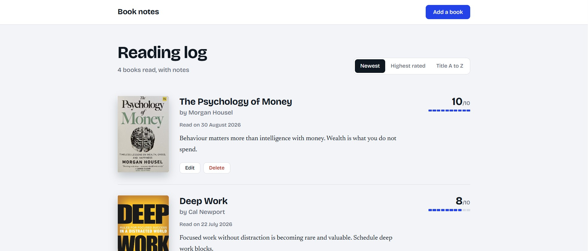

# Book Notes


A personal reading log where I store the books I've read, with ratings,
notes and covers. Built as a capstone project for The Complete Full-Stack
Web Development Bootcamp.

## Features
- Add, edit and delete books (full CRUD)
- Sort by newest, highest rated, or title
- Book covers fetched from the Open Library Covers API using Axios
- Data stored in PostgreSQL
- Styled error pages for missing pages and failed requests

## Built with
Node.js, Express, EJS, PostgreSQL (pg), Axios, HTML and CSS

## Run it locally

1. Clone the repo and install dependencies:
```bash
   npm install
```
2. Create a PostgreSQL database called `books` and run `schema.sql` in it.
3. Copy `.env.example` to `.env` and add your database password.
4. Start the app:
```bash
   node index.js
```
5. Open http://localhost:3000

## What I learned
- Designing a database schema and writing parameterized SQL queries
- Integrating a public API with Axios, including handling failures
- Structuring an Express app with EJS views and partials